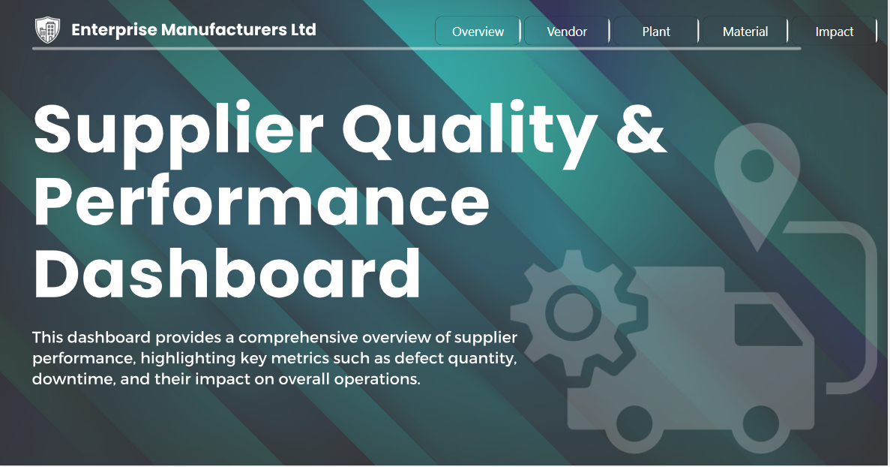
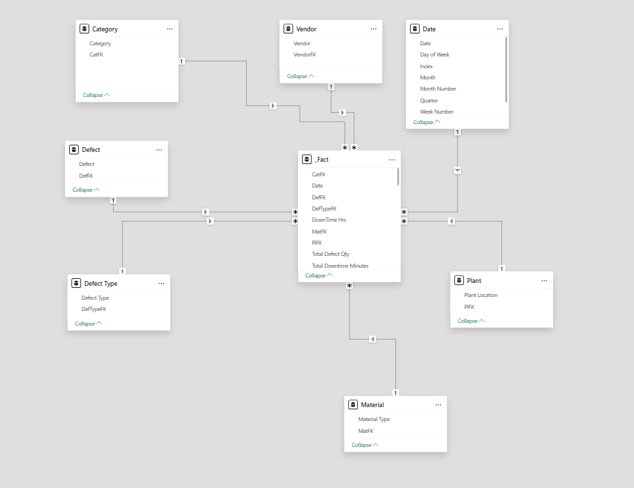
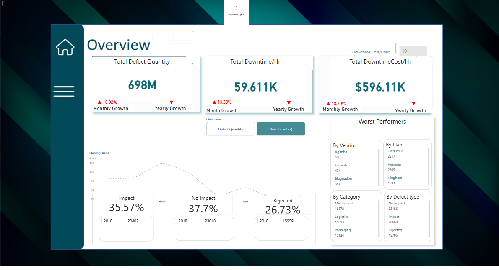
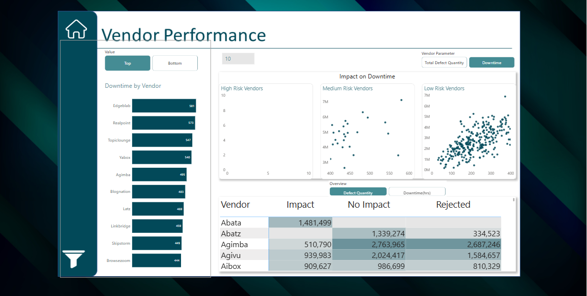
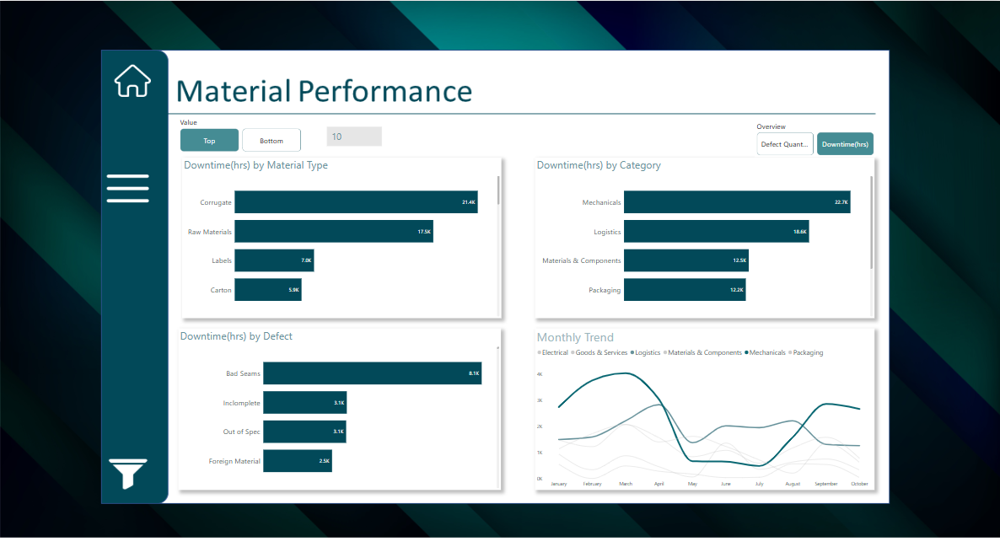

# Supplier_Quality

## Introduction
This Project uses PowerBI and Micrsoft Exel for Data Cleaning and Analyze an imaginary manufacturing company called **"Enterprise Manufactures** ltd.

The project is to analyse and derive insights on Vendor,Plant Locations,Defective Materials and the effect on Downtime hours and Downtime costs per hour to answer crucial business questions for the company to make data-driven decisions.

**_Disclaimer_**: _All datasets and reports do not represent any company, businesss or Persons, but a dummy dataset to demonstrate the use of Power BI in data analysis._

## Problem Statement
1. Which Plant produces the most defective materials?
2. Which Vendor supplies the most defective material?
3. Which of these defective materials cause the greatest downtime?
4. How much per hour is lost from these defective marerials?

## Skills/Concepts demonstrated
The following Power BI features were incorporated
- Merging
- Data modeling
- DAX
- Parameters
- Buttons
- Filters
- Tooltips
- Bookmarks
- Page navigations

## Data Modeling
  Relationships between the tables were manually created
  
  
Model is a **star schema**
There are six dimension tables including a **Date Table** to one fact table
All dimension tables were connected to the Fact table with a **one-to-many relationship**

## Visualization
The Report comprises four(4) pages
- Overview
- Vendor
- Plant Location
- Material
- Defects
You can interact with the report here [Click here](https://app.powerbi.com/view?r=eyJrIjoiMTY2YTUyYjYtNTU5NC00M2Q1LTk3NjItNjEzZjQ5NmE2MWQzIiwidCI6IjQ2ODM5MjNmLTdhMjQtNDBlNC05MzhlLWNiZGIwNjVjY2NjZSJ9)

## Vendor Performance

### Features;
The Home icon is a button that takes you to the Overview page
Menu icon displays slicers and navigation buttons
## Analysis
- The Vendor who delivered the most defective material was found to be **Edgeblab** with total of **587** materials
- **Abata** became the vendor whose material had the most impact on downtime with a whooping total of **1,481,499(hrs)** downtime hours
  
## Material Performance

### Features;
The Home icon is a button that takes you to the Overview page
Menu icon displays slicers and navigation buttons
## Analysis
- **Corrugate** appeared is the highest defective material to be supplied with **21.4k** defective materials and it falls into the **Mechanicals** Category which also topped the chart in the rating for highest category with total of **22.7k** defects.
- The least material with causing **Downtime(hrs)** is **Bad Seams** with **8.1k** defective materials and it is found in the **Packaging** Category which has total of **12.2k** defects
  
- Also, Logistics Category appeared to be the material category that peaks the most amongst others during the month of March

## Conclusion and Recommendation
- Enterprise Manufacturers have suffered a great loss due to Downtime hours
- Corrugate materials have been discovered to be the major cause of this and therefore proper investigations should be carried out before the us of these materials
- Vendors who supply thee defective materials should be interrogated and possibly replaced with better vendors
- **Charlse City** Plant should cary out thorough investigations into both their vendors and the materials they distribute
  
   
  

